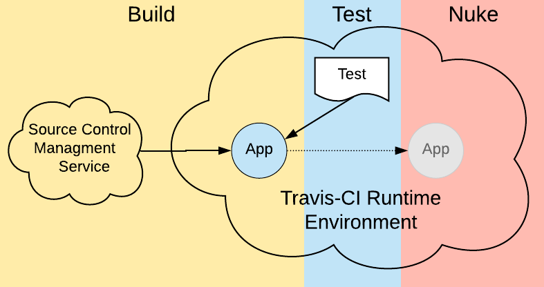

# The Build, Test, Nuke Pattern
> A Tutorial on Testing Etiquette in the Age of Ephemeral Computing

Nothing lasts forever in the world of ephemeral computing. It’s the nature of the beast. Today, more companies are maximizing their IT budgets by practicing the principles of infrastructure as code (IaC). They’re creating and destroying virtual assets on demand in order to meet the needs of the moment.
Paying only for what you use makes sense technically and financially. IaC offers a lot of benefits, but it does take some getting used to, particularly with regard to resource management.

There’s a certain etiquette involved when a lot of people are using a common set of resources. In a way, being part of an IaC environment is similar to using the laundry room in an apartment building. You need to be aware that other people are using the washers, dryers and folding tables. Thus, you need to keep moving your clothes along from washer to dryer in a timely manner, and you need to clean up after yourself, always.

The same is true in ephemeral computing. There is nothing more irritating than testing on a virtual machine that is all clogged up with useless applications and components left behind from previous tests. Not only do such remnants take up valuable computing resources, but they might also compromise the outcome of your testing. 

When running tests in an ephemeral, IaC environment, a good pattern to follow is one that I call the Build, Test, Nuke pattern. Let’s explore the pattern using an example from a set of unit tests I created in my [Deno demonstration project](https://github.com/reselbob/denodemo) and ran on Travis CI.


## Understanding Build, Test, Nuke

The structure of the Build, Test, Nuke pattern is to divide the testing event into three stages. In the first stage, Build, your testing script gets the source code from a source control management service, such as GitHub, and builds the required dependencies into a deployment unit, such as a Docker container. In the second stage, Test, the script tests the artifact. Then, in the third stage, Nuke, your script destroys the deployment artifacts used in the testing, removing them from both memory and disk. (See figure 1 below.)


> Figure 1: The Build, Test, Nuke pattern

The benefit of the pattern is apparent. Your scripts are using only the resources needed, when they’re needed. For a small application, using the pattern might seem trivial. But, when you get into an application that has a dozen dependencies running in separate processes that put pressure on both memory and network IO, leaving them up and running after testing is done can be a significant risk. Destroying everything when testing is over addresses this risk head-on.

Now that we’ve covered the concept behind the Build, Test, and Nuke pattern, let’s take a look at how it’s implemented when running a set of unit tests under Travis CI.

## Putting Build, Nuke, Test into Action

As mentioned above, I use the Build, Nuke and Test pattern in a set of HTTP tests I created for an application in my [Deno](https://deno.land/) demonstration project, which you can find [here].(https://github.com/reselbob/denodemo The application is called [SimpleCalc](https://github.com/reselbob/denodemo/tree/master/simplecalc_). SimpleCalc is an API that exposes the math operations `add`, `subtract`, `multiply` and `divide`. The API runs as a web application over HTTP.

## What is Deno? 

Deno is a next-generation programming framework developed by Ryan Dahl, the creator of Node.js. Deno runs using the V8 JavaScript, as does Node.js, but Deno uses the Typescript language to program. Deno also improves upon Node.js in other ways, such as the way dependencies are stored and runtime permissions are granted. For more information about Deno, visit the website at: https://deno.land/.

The way the HTTP test works is the script creates the web server that hosts the SimpleCalc API in a [Docker](https://www.docker.com/resources/what-container) [container](https://www.docker.com/resources/what-container). Then, once the SimpleCalc API server is up and running, a set of Deno tests are run. After the tests are run, the test script destroys both the container in which the SimpleCalc API server is running and the [container image](https://stackoverflow.com/questions/23735149/what-is-the-difference-between-a-docker-image-and-a-container) that’s used to create the container for the SimpleCalc API. (You can think of a container image as the template that describes the container that will run in memory.)

Listing 1 below shows the Bash script that creates the container, runs the HTTP tests, and then destroys the container and container image.

```bash
#!/bin/bash
cd ..

docker build -t mydenoserver .
docker run -d --name simplecalc -p 7700:7700 mydenoserver

deno test  --allow-net --allow-env --allow-read --allow-write --reload

docker rm -f simplecalc
docker rmi -f mydenoserver
```
> Listing 1: The Bash script that implements the Build, Test and Nuke pattern

Notice that the Build phase takes place at lines 4 and 5. The script uses the Docker [build](https://docs.docker.com/engine/reference/commandline/build/) command to create a container image named mydenoserver using the default [Dockerfile](https://github.com/reselbob/denodemo/blob/master/simplecalc/Dockerfile) stored along with the source code. (See line 4 above.) Then, at line 5, the script executes [docker run](https://docs.docker.com/engine/reference/commandline/run/) to run a container named `simplecalc` using the container image `mydenoserver`.

Line 7 in listing 1 above invokes the unit tests that are stored in the test directory of the `SimpleCalc` app source code files. (The Deno test looks for test files in a directory named `test` by default.)

Listing 2 below shows an excerpt from the test file [api_tests.ts](https://github.com/reselbob/denodemo/blob/master/simplecalc/test/api_tests.ts). Notice at line 9 that the test accesses the SimpleCalc API’s add operation by way of the webserver running at http://0.0.0.0:7700/sum/8,4,3. The IP address 0.0.0.0 indicates the source address for the local computer on which the test is running. The SimpleCalc API is listening for traffic on port 7700. The /sum/8,4.3 segment of the URL is special to the SimpleCalc API. It describes the sum operation and an array of integers that will be summed up by the operation.

```javascript
import { assertEquals } from "https://deno.land/std/testing/asserts.ts";

// The test, Can add from API, is an excerpt from a set of many tests
Deno.test({
    name: "Can add from API",
    ignore: false,
    async fn() {
        const url = `http://0.0.0.0:7700/sum/8,4,3`
        await fetch(url)
        .then((response) => {
            return response.text()
        })
        .then(data => {
            assertEquals(Number(data), 15);
        })
    },
  });
```
> Listing 2: An excerpt from the test of HTTP tests that exercise the SimpleCalc API.

The important thing to know about listing 2 above is that it describes a test that is run against a container that hosts the web server, and that container was created on demand as part of the testing process.
After the test is completed, the Bash script controlling the entire process will issue these two commands as shown below, as well as above in listing 1 at lines 9 and 10:

```bash
docker rm -f simplecalc
docker rmi -f mydenoserver
```

These are the commands that remove both the container and the container image from the host environment. These two lines fulfill the last part of the Build, Test, Nuke pattern. As you can see, the container and the container image are removed completely from the virtual machine host.

Listing 3 below shows the `.travis.yml` file that gets run when new or adjusted code is committed to the demonstration Deno project.

```yaml
language: default
os: ubuntu
services:
    - docker
branches:
    only:
    - master
before_install:
    - pwd
    - curl -fsSL https://deno.land/x/install/install.sh | sh
    - ls -l $HOME/.deno
    - export DENO_INSTALL="$HOME/.deno"
    - export PATH="$DENO_INSTALL/bin:$PATH"
    - deno run https://deno.land/std/examples/welcome.ts
    
script: 
    - cd ./simplecalc/test/
    - sh run_test.sh
 ```
 > Listing 3: The Travis.yml file that installs Deno executes the script run_test.sh, which implements the Build, Test, Nuke pattern in the Travis runtime environment.
 
 One of the nice features of Travis CI is that I can register the Deno demonstration project that’s hosted on GitHub with Travis. Once registered, Travis will install a webhook in the GitHub repo that makes it so when code is committed to the repo, the repo will be cloned automatically into a Travis CI virtual machine dedicated to my testing session. Travis looks for the `.travis.yml` in the source code and then, once identified, will configure the virtual machine according to settings in the `.travis.yml` file.
 
In this case, the instructions to install Deno are at lines 8 through 14 in listing 3 above. The instruction to navigate to the directory that has the Bash script that controls the testing process is at line 17. The instruction to execute the Bash script is at line 18.

Remember, the Bash script contains all the instructions to execute the Build, Test, and Nuke pattern. Mission accomplished!

## Putting It All Together

The Build, Test, and Nuke pattern is simple and powerful. Using it consistently as part of your CI/CD process will help you run your tests as a reliable, good neighbor in the host runtime environment, whether they’re running on your local machine, under Travis or anywhere else in the cloud.


